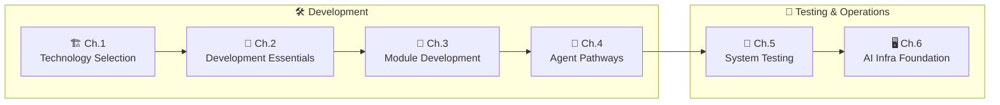

<div align="center">

# 🤖 build_a_product_agent

**Building Production-Grade AI Agents · A Technical Manual**

*A systematic guide to designing, building, testing, and operating production-grade Agent systems from scratch*

<br/>

**🌐 [English](./README-en.md) · [简体中文](./README.md)**

<br/>

**✍️ Author: [ADW-19](https://github.com/ADW-19) · Lujiazui, Pudong New Area, Shanghai, China · RedNote: `ADW_AI`**

<br/>

[](./LICENSE)
[](https://github.com/ADW-19/build_a_product_agent/stargazers)
[](https://github.com/ADW-19/build_a_product_agent/commits/main)
[](./README.md)
[](https://github.com/ADW-19/build_a_product_agent/pulls)

<br/>

[Quick Start](#quick-start) · [Learning Path](#learning-path) · [Content Overview](#content-overview) · [Tech Stack](#tech-stack) · [中文](./README.md)

</div>

---

> [!IMPORTANT]
> **Version Note**: This documentation is based on the author's hands-on development experience and will be updated from time to time. As the author's native language is Chinese, it primarily targets readers in Chinese-speaking regions (Mainland China, Hong Kong, Macau, Taiwan) as well as countries such as Singapore. A full English edition may be considered in the future if there is significant international interest.
>
> 🌐 中文读者：请从[中文版落地页](./README.md)开始阅读。

---

## Project Overview

This is a **documentation-only project** focused on the core knowledge points of AI Agent backend development. Each chapter is a self-contained technical article covering:

| | | | |
|:---:|:---:|:---:|:---:|
| 🏗️<br/>**Technology Selection & Architecture** | 🧩<br/>**Key Module Development** | 🤖<br/>**Agent Pathways & Multi-Agent Collaboration** | 🧪<br/>**System Testing & Deployment Verification** |
| | 🖥️<br/>**AI Infra Foundation & Model Selection** | | |

**What makes this manual different:**

| 💡 | Description |
|:---:|:---|
| 🏭 **Industry Standards** | Every topic starts from real production requirements, not toy demos |
| ❌ **Wrong Code First** | Each section shows why the "typical classroom approach" breaks in production before presenting the correct one — a strict convention |
| ✅ **Unified Skeleton** | Examples are Python 3.13+ async style, built on one shared skeleton (`core/` + `routes/` + `services/`); cross-file symbols follow that convention (see `CLAUDE.md`) |
| 🧪 **Testing & Ops Included** | Covers not just "how to build", but also "how to test" and "how to operate" |

> 🎯 **Target audience**: Developers with basic programming skills. The entire book follows the narrative **"Industry Standards → Why Schools Don't Teach This → How You Should Code"**.

---

## Learning Path



---

## Quick Start

```bash
# Clone the project
git clone https://github.com/ADW-19/build_a_product_agent.git
cd build_a_product_agent

# Recommended reading order (follow the path above)
# 1. Chapter 1: Technology Selection (understand overall tech stack)
# 2. Chapter 2: Development Essentials (coding standards)
# 3. Chapter 3: Module Development (implementation details)
# 4. Chapter 4: Agent Pathways (single & multi-agent collaboration)
# 5. Chapter 5: System Testing (pre-deployment testing framework)
# 6. Chapter 6: AI Infra Foundation (model deployment & selection)
```

---

## Content Overview

| Chapter | Topic | Highlight |
|:---:|:---|:---|
| 🏗️ **Ch.1** | Technology Selection | Selection logic for languages / frameworks / middleware / protocols (MCP + A2A) / ops architecture |
| 📐 **Ch.2** | Development Essentials | Production-grade habits: `.env`, Redis, async, logging, exception handling, type annotations |
| 🧩 **Ch.3** | Module Development | Chat interface / memory / tools / workflow / RAG — five core modules in depth |
| 🤖 **Ch.4** | Agent Pathways | Complete single-agent pathway (incl. HITL, Plan-and-Execute) + Multi-Agent collaboration (A2A 1.0) |
| 🧪 **Ch.5** | System Testing | Five-dimensional testing framework: functionality / quality / security / performance / deployment |
| 🖥️ **Ch.6** | AI Infra Foundation | Model deployment & ops + three-layer model selection architecture |

<details>
<summary>🏗️ <b>Chapter 1: Technology Selection</b> (4 articles)</summary>

| File | Content |
|:---|:---|
| `第1章：技术选型/01-技术选型.md` | Language, framework, Agent orchestration tool selection |
| `第1章：技术选型/02-中间件选型.md` | Database, cache, message queue selection |
| `第1章：技术选型/03-协议与架构模式选型.md` | MCP (tool & context access), A2A (agent-to-agent collaboration), communication patterns, architecture styles |
| `第1章：技术选型/04-运维架构选型.md` | Deployment, monitoring, logging, disaster recovery |

</details>

<details>
<summary>📐 <b>Chapter 2: Development Essentials</b> (1 article)</summary>

| File | Content |
|:---|:---|
| `第2章：开发基本要求/01-开发习惯.md` | Config management, Redis, async, logging standards |

</details>

<details>
<summary>🧩 <b>Chapter 3: Module Development</b> (5 articles)</summary>

| File | Content |
|:---|:---|
| `第3章：模块开发/01-对话接口（流式+非流式参数切换，session_id隔离，接口异步高性能处理）.md` | Streaming/non-streaming, session isolation, async high concurrency |
| `第3章：模块开发/02-长期记忆与短期记忆.md` | Milvus + Redis combination |
| `第3章：模块开发/03-工具开发.md` | LangChain tool definition, call accuracy |
| `第3章：模块开发/04-工作流.md` | LangGraph StateGraph, structured output, checkpointer & resume |
| `第3章：模块开发/05-RAG系统.md` | Retrieval-augmented generation + retrieval metrics (Recall@k / nDCG / MRR) |

</details>

<details>
<summary>🤖 <b>Chapter 4: Agent Pathways</b> (2 articles)</summary>

| File | Content |
|:---|:---|
| `第4章：Agent通路/01-单Agent系统通路.md` | Complete implementation path for single Agent (HITL, Plan-and-Execute) |
| `第4章：Agent通路/02-Multi-Agent协作机制（A2A协议）.md` | A2A protocol (spec 1.0.0), multi-agent collaboration patterns |

</details>

<details>
<summary>🧪 <b>Chapter 5: System Testing</b> (2 articles)</summary>

| File | Content |
|:---|:---|
| `第5章：系统测试/01-Agent上线前常用的系统测试方法.md` | Five-dimensional testing framework overview (functionality/quality/security/performance/deployment) |
| `第5章：系统测试/02-RAG系统测试.md` | E-commerce customer service example: intent recognition, retrieval recall/precision, generation quality, security, concurrency end-to-end test |

</details>

<details>
<summary>🖥️ <b>Chapter 6: AI Infra Foundation</b> (2 articles)</summary>

| File | Content |
|:---|:---|
| `第6章：AI Infra基础知识/01-模型底座运维基础知识与架构选型.md` | supervisorctl process management, master-slave failover, Docker+K8s, VLLM/SGlang |
| `第6章：AI Infra基础知识/02-模型选型-不同智能体如何搭配底层模型.md` | 3D selection framework (params × ecosystem × performance), coding Agent walkthrough |

</details>

---

## Tech Stack

> **Versions are a baseline snapshot as of the calibration date, not a lower-bound claim.** The ecosystem moves a full generation every ~6 months (LangChain 1.x moved chains/retrievers to `langchain-classic`, `create_react_agent` is deprecated, pymilvus 3.x requires `MilvusClient`). Check the APIs against your own pinned versions — don't trust the version number alone.

**Baseline (calibrated 2026-09)**

| Domain | Selection | Baseline | Notes |
|:---:|:---:|:---:|:---|
| Language |  | 3.14 (3.13 also fine) | 3.13 enters security-only fixes after 2026-10 |
| Web Framework |  | 0.141 | |
| Agent Orchestration |  | 1.2 | `set_entry_point`, `create_react_agent` are deprecated |
| LLM Tool Layer |  | 1.4 | Prefer `langchain.agents.create_agent` |
| Data Validation |  | 2.13 | v2 APIs (`model_dump()`) |
| Business Database |  | 16+ | |
| Cache / Session / Rate Limit |  | 8+ / Stack | Checkpointer needs RediSearch + RedisJSON |
| Vector DB (Long-term Memory) |  | 2.6+ / pymilvus 3.x | Use `MilvusClient`, not the deprecated ORM style |
| Message Queue |  | 4.x | Quorum queues do not support `x-max-priority` |

**Protocols** (Chapter 1):

- **MCP** (Model Context Protocol) — connects an Agent to **tools and context**; hosted by the Linux Foundation's Agentic AI Foundation since 2025-12;
- **A2A** (Agent2Agent) — connects an Agent to **other Agents**; specification baseline 1.0.0 (calibrated 2026-09).

They are complementary, not competing: MCP for tools, A2A for agents.

> [!NOTE]
> **Model IDs and prices in the examples are placeholders only.** Model lifecycles are short — `gpt-4o`, for instance, was retired from ChatGPT in 2026-02 and retires on Azure on 2026-10-01. Before going live, verify the model IDs (`gpt-5.1` / `gpt-5-mini` / `claude-sonnet-4-6`) and prices against the vendor's model lifecycle page, and keep model IDs in configuration rather than scattered across business code.

---

## Directory Structure

<details>
<summary>📁 Click to expand the full directory tree</summary>

```text
build_a_product_agent/
├── scripts/
│   └── check_snippets.py            # code-block validation gate
│
└── docs/                            # All content is Simplified Chinese
    ├── 01-首页/                      # Landing pages (Chinese / English)
    │   ├── README.md
    │   └── README-en.md
    │
    ├── 02-生产级开发-通用知识/        # Ch.1–4
    │   ├── 第1章：技术选型/           # 01-技术选型.md / 02-中间件选型.md
    │   │                             # 03-协议与架构模式选型.md / 04-运维架构选型.md
    │   ├── 第2章：开发基本要求/       # 01-开发习惯.md
    │   ├── 第3章：模块开发/           # 01-对话接口… / 02-长期记忆与短期记忆.md
    │   │                             # 03-工具开发.md / 04-工作流.md / 05-RAG系统.md
    │   └── 第4章：Agent通路/          # 01-单Agent系统通路.md
    │                                 # 02-Multi-Agent协作机制（A2A协议）.md
    │
    ├── 03-生产级测试-系统测试/        # Ch.5
    │   └── 第5章：系统测试/           # 01-Agent上线前常用的系统测试方法.md
    │                                 # 02-RAG系统测试.md
    │
    └── 04-生产级AI Infra-基座与运维/  # Ch.6
        └── 第6章：AI Infra基础知识/   # 01-模型底座运维基础知识与架构选型.md
                                      # 02-模型选型-不同智能体如何搭配底层模型.md
```

</details>

---

## 👤 Author & Community

| | |
|:---:|:---|
| ✍️ **Author** | ADW-19 · Lujiazui, Pudong New Area, Shanghai, China |
| 📕 **RedNote (Xiaohongshu)** | ID: `ADW_AI` |

Feel free to open an issue for suggestions or corrections, or submit a PR directly.

---

## License

<div align="center">

This project is open source under the [MIT License](./LICENSE).

If this manual helps you, please consider giving it a **Star ⭐**!

[](https://github.com/ADW-19/build_a_product_agent/stargazers)
[](./LICENSE)

</div>
