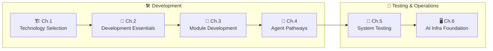

<div align="center">

# 🤖 build_a_product_agent

**Building Production-Grade AI Agents · A Technical Manual**

*A systematic guide to designing, building, testing, and operating production-grade Agent systems from scratch*

<br/>

[](./LICENSE)
[](https://github.com/ADW-19/build_a_product_agent/stargazers)
[](https://github.com/ADW-19/build_a_product_agent/commits/main)
[](./README.md)
[](https://github.com/ADW-19/build_a_product_agent/pulls)

<br/>

[Quick Start](#quick-start) · [Learning Path](#learning-path) · [Content Overview](#content-overview) · [Tech Stack](#tech-stack) · [中文](./README.md)

</div>

---

> [!IMPORTANT]
> **Version Note**: This documentation is based on the author's hands-on development experience and will be updated from time to time. As the author's native language is Chinese, it primarily serves technical professionals in Mainland China, Hong Kong, Macau, Taiwan, Singapore, and other regions. A full English edition may be considered in the future if there is significant international interest.

---

## Project Overview

This is a **documentation-only project** focused on the core knowledge points of AI Agent backend development. Each chapter is a self-contained technical article covering:

| | | | |
|:---:|:---:|:---:|:---:|
| 🏗️<br/>**Technology Selection & Architecture** | 🧩<br/>**Key Module Development** | 🤖<br/>**Agent Pathways & Multi-Agent Collaboration** | 🧪<br/>**System Testing & Deployment Verification** |
| | 🖥️<br/>**AI Infra Foundation & Model Selection** | | |

**What makes this manual different:**

| 💡 | Description |
|:---:|:---|
| 🏭 **Industry Standards** | Every topic starts from real production requirements, not toy demos |
| ❌ **Wrong Code First** | Each section shows why the "typical classroom approach" breaks in production before presenting the correct one — a strict convention |
| ✅ **Complete Runnable Code** | All examples are Python 3.13+ async style, ready to drop into a real project skeleton |
| 🧪 **Testing & Ops Included** | Covers not just "how to build", but also "how to test" and "how to operate" |

> 🎯 **Target audience**: Developers with basic programming skills. The entire book follows the narrative **"Industry Standards → Why Schools Don't Teach This → How You Should Code"**.

---

## Learning Path



---

## Quick Start

```bash
# Clone the project
git clone https://github.com/ADW-19/build_a_product_agent.git
cd build_a_product_agent

# Recommended reading order (follow the path above)
# 1. Chapter 1: Technology Selection (understand overall tech stack)
# 2. Chapter 2: Development Essentials (coding standards)
# 3. Chapter 3: Module Development (implementation details)
# 4. Chapter 4: Agent Pathways (single & multi-agent collaboration)
# 5. Chapter 5: System Testing (pre-deployment testing framework)
# 6. Chapter 6: AI Infra Foundation (model deployment & selection)
```

---

## Content Overview

| Chapter | Topic | Highlight |
|:---:|:---|:---|
| 🏗️ **Ch.1** | Technology Selection | Selection logic for languages / frameworks / middleware / protocols / ops architecture |
| 📐 **Ch.2** | Development Essentials | Production-grade habits: `.env`, Redis, async, logging, exception handling, type annotations |
| 🧩 **Ch.3** | Module Development | Chat interface / memory / tools / workflow / RAG — five core modules in depth |
| 🤖 **Ch.4** | Agent Pathways | Complete single-agent pathway + Multi-Agent collaboration (A2A protocol) |
| 🧪 **Ch.5** | System Testing | Five-dimensional testing framework: functionality / quality / security / performance / deployment |
| 🖥️ **Ch.6** | AI Infra Foundation | Model deployment & ops + three-layer model selection architecture |

<details>
<summary>🏗️ <b>Chapter 1: Technology Selection</b> (4 articles)</summary>

| File | Content |
|:---|:---|
| `01-technology-selection.md` | Language, framework, Agent orchestration tool selection |
| `02-middleware-selection.md` | Database, cache, message queue selection |
| `03-protocol-and-architecture-pattern-selection.md` | API protocol, communication patterns, architecture styles |
| `04-devops-architecture-selection.md` | Deployment, monitoring, logging, disaster recovery |

</details>

<details>
<summary>📐 <b>Chapter 2: Development Essentials</b> (1 article)</summary>

| File | Content |
|:---|:---|
| `01-development-habits.md` | Config management, Redis, async, logging standards |

</details>

<details>
<summary>🧩 <b>Chapter 3: Module Development</b> (5 articles)</summary>

| File | Content |
|:---|:---|
| `01-chat-interface.md` | Streaming/non-streaming, session isolation, async high concurrency |
| `02-long-term-and-short-term-memory.md` | Milvus + Redis combination |
| `03-tool-development.md` | LangChain tool definition, call accuracy |
| `04-workflow.md` | LangGraph StateGraph, structured output |
| `05-rag-system.md` | Retrieval-augmented generation best practices |

</details>

<details>
<summary>🤖 <b>Chapter 4: Agent Pathways</b> (2 articles)</summary>

| File | Content |
|:---|:---|
| `01-single-agent-system-pathway.md` | Complete implementation path for single Agent |
| `02-multi-agent-collaboration-mechanism.md` | A2A protocol, multi-agent collaboration patterns |

</details>

<details>
<summary>🧪 <b>Chapter 5: System Testing</b> (2 articles)</summary>

| File | Content |
|:---|:---|
| `01-agent-system-testing-methods.md` | Five-dimensional testing framework overview (functionality/quality/security/performance/deployment) |
| `02-rag-system-testing.md` | E-commerce customer service example: intent recognition, retrieval recall/precision, generation quality, security, concurrency end-to-end test |

</details>

<details>
<summary>🖥️ <b>Chapter 6: AI Infra Foundation</b> (2 articles)</summary>

| File | Content |
|:---|:---|
| `01-model-infra-basics-and-architecture-selection.md` | supervisorctl process management, master-slave failover, Docker+K8s, VLLM/SGlang |
| `02-model-selection-agent-model-matching.md` | 3D selection framework (params × ecosystem × performance), coding Agent walkthrough |

</details>

---

## Tech Stack

> All code examples in this manual are built around the following stack — versions are the manual's minimum baseline:

| Domain | Selection | Version |
|:---:|:---:|:---:|
| Language |  | 3.13+ |
| Web Framework |  | ≥ 0.136 |
| Agent Orchestration |  | ≥ 1.2 |
| LLM Tool Layer |  | ≥ 1.3 |
| Data Validation |  | ≥ 2.13 |
| Business Database |  | — |
| Cache / Session / Rate Limit |  | — |
| Vector DB (Long-term Memory) |  | — |
| Message Queue |  | — |

---

## Directory Structure

<details>
<summary>📁 Click to expand the full directory tree</summary>

```text
docs/
├── 01-home/
│   ├── README.md
│   └── README-en.md
│
├── 02-production-grade-development-general/
│   ├── Chapter1-technology-selection/
│   │   ├── 01-technology-selection.md
│   │   ├── 02-middleware-selection.md
│   │   ├── 03-protocol-and-architecture-pattern-selection.md
│   │   └── 04-devops-architecture-selection.md
│   │
│   ├── Chapter2-development-essentials/
│   │   └── 01-development-habits.md
│   │
│   ├── Chapter3-module-development/
│   │   ├── 01-chat-interface.md
│   │   ├── 02-long-term-and-short-term-memory.md
│   │   ├── 03-tool-development.md
│   │   ├── 04-workflow.md
│   │   └── 05-rag-system.md
│   │
│   └── Chapter4-agent-pathways/
│       ├── 01-single-agent-system-pathway.md
│       └── 02-multi-agent-collaboration-mechanism.md
│
├── 03-production-grade-testing-system-testing/
│   └── Chapter5-system-testing/
│       ├── 01-agent-system-testing-methods.md
│       └── 02-rag-system-testing.md
│
└── 04-production-grade-ai-infra/
    └── Chapter6-ai-infra-basics/
        ├── 01-model-infra-basics-and-architecture-selection.md
        └── 02-model-selection-agent-model-matching.md
```

</details>

---

## 👤 Author & Community

| | |
|:---:|:---|
| ✍️ **Author** | ADW-19 · Shanghai, China |
| 📕 **RedNote (Xiaohongshu)** | ID: `ADW_AI` |

Feel free to open an issue for suggestions or corrections, or submit a PR directly.

---

## License

<div align="center">

This project is open source under the [MIT License](./LICENSE).

If this manual helps you, please consider giving it a **Star ⭐**!

[](https://github.com/ADW-19/build_a_product_agent/stargazers)
[](./LICENSE)

</div>
