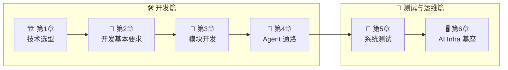

<div align="center">

# 🤖 build_a_product_agent

**构建生产级 AI Agent · 中文技术手册**

*系统讲解如何从零设计、实现、测试并运维一套生产级 Agent 系统*

<br/>

**🌐 [English](./README-en.md) · [简体中文](./README.md)**

<br/>

**✍️ 作者：[ADW-19](https://github.com/ADW-19) · 中国，上海市，浦东新区，陆家嘴 · 小红书：`ADW_AI`**

<br/>

[](./LICENSE)
[](https://github.com/ADW-19/build_a_product_agent/stargazers)
[](https://github.com/ADW-19/build_a_product_agent/commits/main)
[](./README-en.md)
[](https://github.com/ADW-19/build_a_product_agent/pulls)

<br/>

[快速开始](#快速开始) · [学习路线](#学习路线) · [内容总览](#内容总览) · [技术栈](#技术栈) · [English](./README-en.md)

</div>

---

> [!IMPORTANT]
> **版本说明**：本文档基于作者开发实战经验创作，将不定期持续更新。作者母语为中文，目前主要面向中国大陆、港澳台、新加坡等地区的技术人士；若国际读者需求较多，后续再考虑推出完整英文版。
>
> 🌐 English readers: start from the [English landing page](./README-en.md).

---

## 项目简介

这是一个**纯文档项目**，专注于 AI Agent 后端开发的核心知识点。每章都是一篇独立成文的技术文章，覆盖：

| | | | |
|:---:|:---:|:---:|:---:|
| 🏗️<br/>**技术选型与架构设计** | 🧩<br/>**关键模块开发** | 🤖<br/>**Agent 通路与多 Agent 协作** | 🧪<br/>**系统测试与上线验证** |
| | 🖥️<br/>**AI Infra 基座与模型选型** | | |

**这本手册和其他教程的区别：**

| 💡 | 说明 |
|:---:|:---|
| 🏭 **工业界标准** | 每个主题都从生产环境的真实要求出发，而不是玩具 Demo |
| ❌ **先看错误示范** | 先展示"课堂典型写法"为什么在生产上会出事，再讲正确做法——强约定 |
| ✅ **代码围绕统一骨架** | 示例为 Python 3.13+ 异步风格，按 `core/` + `routes/` + `services/` 的统一骨架编写；跨文件符号按骨架约定引用（见 `CLAUDE.md`） |
| 🧪 **测试与运维并重** | 不止"怎么写"，还讲"怎么测"和"怎么运维" |

> 🎯 **目标读者**：具备一定编程基础的开发者。全书以 **「工业界标准 → 为什么课堂不教 → 你应该怎么写」** 为叙事线。

---

## 学习路线



---

## 快速开始

```bash
# 克隆项目
git clone https://github.com/ADW-19/build_a_product_agent.git
cd build_a_product_agent

# 阅读顺序建议（按上图路线）
# 1. 第1章：技术选型（了解整体技术栈）
# 2. 第2章：开发基本要求（编码规范）
# 3. 第3章：模块开发（深入实现细节）
# 4. 第4章：Agent通路（单Agent与多Agent协作）
# 5. 第5章：系统测试（上线前的测试体系）
# 6. 第6章：AI Infra 基座（模型部署与选型）
```

---

## 内容总览

| 章节 | 主题 | 一句话看点 |
|:---:|:---|:---|
| 🏗️ **第1章** | 技术选型 | 语言 / 框架 / 中间件 / 协议（MCP + A2A）/ 运维架构的全套选型逻辑 |
| 📐 **第2章** | 开发基本要求 | `.env`、Redis、async、日志、异常处理、类型注解的生产级习惯 |
| 🧩 **第3章** | 模块开发 | 对话接口 / 记忆 / 工具 / 工作流 / RAG 五大模块逐个击破 |
| 🤖 **第4章** | Agent 通路 | 单 Agent 完整通路（含 HITL、Plan-and-Execute）+ Multi-Agent（A2A 1.0）协作机制 |
| 🧪 **第5章** | 系统测试 | 功能 / 质量 / 安全 / 性能 / 上线五维测试体系 |
| 🖥️ **第6章** | AI Infra 基座 | 模型部署运维 + 三层模型选型架构 |

<details>
<summary>🏗️ <b>第1章：技术选型</b>（4 篇）</summary>

| 文件 | 内容 |
|:---|:---|
| `01-技术选型.md` | 语言、框架、Agent 编排工具选型 |
| `02-中间件选型.md` | 数据库、缓存、消息队列选型 |
| `03-协议与架构模式选型.md` | MCP（工具与上下文接入）、A2A（Agent 间协作）、通信模式、架构风格 |
| `04-运维架构选型.md` | 部署、监控、日志、容灾 |

</details>

<details>
<summary>📐 <b>第2章：开发基本要求</b>（1 篇）</summary>

| 文件 | 内容 |
|:---|:---|
| `01-开发习惯.md` | 配置管理、Redis、async、日志规范 |

</details>

<details>
<summary>🧩 <b>第3章：模块开发</b>（5 篇）</summary>

| 文件 | 内容 |
|:---|:---|
| `01-对话接口.md` | 流式/非流式、session 隔离、异步高并发 |
| `02-长期记忆与短期记忆.md` | Milvus + Redis 组合使用 |
| `03-工具开发.md` | LangChain tool 定义、调用准确性 |
| `04-工作流.md` | LangGraph StateGraph、结构化输出、checkpointer 与断点续跑 |
| `05-RAG系统.md` | 检索增强生成最佳实践 + 检索效果度量（Recall@k / nDCG / MRR） |

</details>

<details>
<summary>🤖 <b>第4章：Agent 通路</b>（2 篇）</summary>

| 文件 | 内容 |
|:---|:---|
| `01-单Agent系统通路.md` | 单 Agent 的完整实现路径 |
| `02-Multi-Agent协作机制.md` | A2A 协议（规范 1.0.0）、多 Agent 协作模式 |

</details>

<details>
<summary>🧪 <b>第5章：系统测试</b>（2 篇）</summary>

| 文件 | 内容 |
|:---|:---|
| `01-Agent上线前常用的系统测试方法.md` | 五维测试体系总述（功能/质量/安全/性能/上线），工业界方法全景 |
| `02-RAG系统测试.md` | 以电商客服为例，意图识别、检索召回/精准、生成质量、安全、并发全链路测试 |

</details>

<details>
<summary>🖥️ <b>第6章：AI Infra 基座</b>（2 篇）</summary>

| 文件 | 内容 |
|:---|:---|
| `01-模型底座运维基础知识与架构选型.md` | supervisorctl 进程管控、主从降级、Docker+K8s、VLLM/SGlang 选型 |
| `02-模型选型-不同智能体如何搭配底层模型.md` | 参数×生态×性能三维选型框架，以编码智能体为例的全流程模型搭配实战 |

</details>

---

## 技术栈

> **版本是"校对当日的基线快照"，不是下限声明。** 生态半年就会前移一代（LangChain 1.x 已把 chains/retrievers 迁到 `langchain-classic`，`create_react_agent` 已弃用，pymilvus 3.x 要求改用 `MilvusClient`），请对照自己的锁定版本核对 API，不要只看版本号。

**基线（校对于 2026-09）**

| 领域 | 选型 | 基线 | 备注 |
|:---:|:---:|:---:|:---|
| 语言 |  | 3.14（3.13 亦可） | 3.13 的 bugfix 窗口 2026-10 结束，之后仅安全修复 |
| Web 框架 |  | 0.141 | |
| Agent 编排 |  | 1.2 | `set_entry_point`、`create_react_agent` 均已弃用 |
| LLM 工具层 |  | 1.4 | 新 Agent 用 `langchain.agents.create_agent` |
| 数据校验 |  | 2.13 | v2 写法（`model_dump()`） |
| 业务数据库 |  | 16+ | |
| 缓存 / 会话 / 限流 |  | 8+ / Stack | checkpointer 依赖 RediSearch + RedisJSON |
| 向量库（长期记忆） |  | 2.6+ / pymilvus 3.x | 新代码用 `MilvusClient`，不用已弃用的 ORM 写法 |
| 消息队列 |  | 4.x | quorum 队列不支持 `x-max-priority` |

**协议层**（第 1 章）：

- **MCP**（Model Context Protocol）——Agent 连**工具与上下文**，2025-12 起由 Linux Foundation 的 Agentic AI Foundation 托管；
- **A2A**（Agent2Agent）——Agent 连 **Agent**，规范基线 1.0.0（校对 2026-09）。

两者互补而非竞品："MCP 连工具、A2A 连 Agent"。

> [!NOTE]
> **示例中的模型与单价只作占位。** 模型生命周期很短——例如 `gpt-4o` 已于 2026-02 从 ChatGPT 退役、Azure 侧 2026-10-01 退役——手册里的模型 ID（`gpt-5.1` / `gpt-5-mini` / `claude-sonnet-4-6`）与价格请在上线前对照厂商的模型生命周期页核对，并把模型 ID 收敛到配置里，不要散落在业务代码中。

---

## 目录结构

<details>
<summary>📁 点击展开完整目录树</summary>

```text
docs/
├── 01-首页/
│   ├── README.md
│   └── README-en.md
│
├── 02-生产级开发-通用知识/
│   ├── 第1章：技术选型/
│   │   ├── 01-技术选型.md
│   │   ├── 02-中间件选型.md
│   │   ├── 03-协议与架构模式选型.md
│   │   └── 04-运维架构选型.md
│   │
│   ├── 第2章：开发基本要求/
│   │   └── 01-开发习惯.md
│   │
│   ├── 第3章：模块开发/
│   │   ├── 01-对话接口（流式+非流式参数切换，session_id隔离，接口异步高性能处理）.md
│   │   ├── 02-长期记忆与短期记忆.md
│   │   ├── 03-工具开发.md
│   │   ├── 04-工作流.md
│   │   └── 05-RAG系统.md
│   │
│   └── 第4章：Agent通路/
│       ├── 01-单Agent系统通路.md
│       └── 02-Multi-Agent协作机制（A2A协议）.md
│
├── 03-生产级测试-系统测试/
│   └── 第5章：系统测试/
│       ├── 01-Agent上线前常用的系统测试方法.md
│       └── 02-RAG系统测试.md
│
└── 04-生产级AI Infra-基座与运维/
    └── 第6章：AI Infra基础知识/
        ├── 01-模型底座运维基础知识与架构选型.md
        └── 02-模型选型-不同智能体如何搭配底层模型.md
```

</details>

---

## 👤 作者与社区

| | |
|:---:|:---|
| ✍️ **作者** | ADW-19 · 中国上海浦东新区，陆家嘴 |
| 📕 **小红书** | ID：`ADW_AI` |

欢迎通过 Issue 提出建议、勘误，或直接提交 PR。

---

## 许可证

<div align="center">

本项目采用 [MIT License](./LICENSE) 开源。

如果这份手册对你有帮助，欢迎点一个 **Star ⭐** 让更多人看到！

[](https://github.com/ADW-19/build_a_product_agent/stargazers)
[](./LICENSE)

</div>
